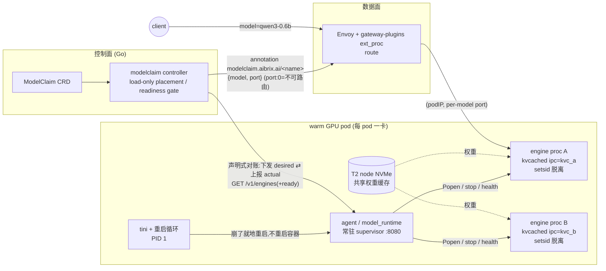

# ModelClaim:高密度多模型 GPU 池化 — 设计文档(内部对齐版)

> 状态:核心链路已实现并在真实 A10 上端到端验证;首 PR 瘦身为 phase-1 核心机制。
> 本文合并了此前分散的 7 份工作文档(见附录 A),供内部对齐用;§10 为新增的 research 机会评估(intern 论文方向)。
> 配套:[kvcached & vLLM sleep 真机测试指南](kvcached-vllm-sleep-test-guide.md)。

---

## 1. 背景与动机

推理成本由长尾模型主导:大量低频/中频模型各自独占 GPU(1 model : 1 GPU),利用率极低;而静态切分(MIG、按比例分卡)不随负载漂移。目标:**把 GPU 池化,在模型粒度上高密度装箱**——N 个模型共享一张卡的 HBM 与算力,空闲模型让位,请求到来时快速唤醒,对客户端透明。

选型立场(相对相关工作,详见 §9):取 ServerlessLLM 的"分层加载 + 局部性 + scale-to-zero"路线,舍弃 Aegaeon 的 token 级调度(复杂度收益比不适合我们的生产形态);大 HBM 机型(B300)是一等公民——权重常驻为主,驱逐是安全阀而非常态。

## 2. 目标 / 非目标

**目标**
- 模型粒度的 N:1 共卡:每模型独立引擎进程,弹性共享 KV(kvcached)。
- 声明式:`kubectl apply` 一个 `ModelClaim` 即完成放置/激活/路由,无需每模型 Deployment。
- phase-1 核心机制:load-only 放置 → kvcached engine activate → readiness gate → route → delete stop。
- 生产可观测:控制面 lifecycle 指标 + runtime KV 观测指标。

**非目标**
- 不做 token 级调度(Aegaeon 路线)、不做在线迁移(低 ROI)、不 fork kvcached(只作机制层经 kvctl//dev/shm 驱动)。
- 首版不做多副本负载伸缩(1 claim : 1 replica 基线;replicas 字段已留)。
- 首 PR 不含 KV 配额/回收决策、sleep driver、scale-to-zero、request hold、节点 locality writer。

## 3. 架构总览



四个组件、两条契约:

| 组件 | 职责(decide vs execute) |
|---|---|
| **ModelClaim CRD**(`api/model/v1alpha1`) | 声明:modelName / podSelector / artifactURL / engine / replicas / engineConfig |
| **controller**(`pkg/controller/modelclaim`) | **决策**:load-only 放置、readiness gate、状态机;经 HTTP 驱动 runtime |
| **agent / runtime**(`python/aibrix/aibrix/runtime/model_runtime*`) | **执行**:Popen kvcached 引擎、stop、per-engine 探活、dead-engine reap、KV 观测;mock 模式可无 GPU 测试 |
| **gateway**(`pkg/plugins/gateway`) | 按 served-model 路由到 (podIP, per-model port);port 0 注解不进入 routable pod map |

契约 1(引擎↔控制面):phase-1 使用命令式 HTTP actuator: `activate / deactivate(stop) / list(+ready,+kv_used,+kv_total)`。声明式 desired/actual 对账与 model-kubelet supervisor 是独立加固线,不在首 PR。
契约 2(控制面↔数据面):warm pod 上的注解 `modelclaim.aibrix.ai/<claim>={"model":…,"port":N}`;**`port:0` = 已知但不可路由**。网关 cache 复用既有 pod informer 读取,零新增 informer。

warm pool 本身就是一个普通的带标签 Deployment(`pool.aibrix.ai/name` + `enabled`),ModelClaim 以 PVC 式语义"认领"池中的容量——这也是命名的由来(对齐 `Model<Role>` 语法:ModelAdapter/ModelClaim)。

## 4. 原子能力层(上游依赖)

| 能力 | 提供方 | 我们怎么用 | 边界 |
|---|---|---|---|
| 弹性 KV | **kvcached**(CUDA VMM,按需映射物理页) | 每引擎独立 `KVCACHED_IPC_NAME`;phase-1 只读 `/dev/shm` MemInfoStruct(3×int64:total/used/prealloc)做观测 | 无 daemon、无调度;`kvctl limit` 配额执行器移入 phase-2 |
| 权重卸载 | **vLLM sleep mode**(`--enable-sleep-mode` + `VLLM_SERVER_DEV_MODE=1`) | phase-1 只保留 launch flags,不驱动 `/sleep`/`wake_up` | 单进程内的整模型挂起,与 kvcached 正交;sleep driver 移入 phase-2 |

验证方式与全部命令见[测试指南](kvcached-vllm-sleep-test-guide.md)。测试指南验证上游原子机制;首 PR 只使用 kvcached launch、KV 观测和 vLLM sleep launch flags。

## 5. 核心机制

> 这一节把"能跑起来"升级成"设计得住":每节给出机制 + 关键决策 + 失效收敛。核心心智 = **给引擎进程做一个 lightweight 的 "model-kubelet"**——k8s 管 pod,pod 内 N 个引擎进程的生命周期/探活/摘流由我们的 agent 自己管。优先级:先把 5.1/5.2/5.5/5.6 的**静态系统层**做扎实("先假设放得下、不搞过度动态"),5.3/5.4 的动态能力降级。

### 5.1 运行时封装 + 控制面↔agent 协议(声明式对账)

**拓扑(三层各司其职)**:`controller`(决策:放哪、路由)→ `agent`(runtime sidecar)→ `engine procs`(vLLM/SGLang + kvcached)。**agent 随 warm pod 常驻**(pod 入口即 agent,不是每次激活临时拉起),把"人肉 bash 进容器手敲 launch"固化成自动化的常驻角色。

**引擎封装**:agent 独占每引擎的 `(served-name, port, ipc_name, proc)`。launch = 测试指南里那条命令的自动化 `Popen`(kvcached env + `--enable-sleep-mode` + `VLLM_SERVER_DEV_MODE=1`),`start_new_session=True` 脱离进程组;port 从池内 `20000+` 分配,ipc 由 claim 派生。对外只暴露 `served-model → (podIP, per-engine port)`,写进注解给网关。

**phase-2 加固方向 = 声明式对账**(phase-1 暂不实现):
- controller → agent:下发**期望态**(该 pod 上应有哪些引擎 + 配置),幂等。
- agent → controller:`GET /v1/engines` 上报**实际态**——每引擎 `{served, port, phase, ready, alive, kv_used, restart_count, last_error}`。**这是引擎状态的单一真源**,消掉现状里 agent-dict / 注解 / controller-status 三处漂移。
- controller reconcile:比对 desired vs actual,只在 `ready` 翻转时改路由注解。
- **防双写**:只有 agent 能动引擎、controller 只动 desired;controller 调不通 agent(pod 重启/分区)→ 保守不动路由、下 tick 重试;协议带 version header。

### 5.2 pod 内生命周期 + 探活 + 流量门控(lightweight model-kubelet)

**每引擎状态机**(k8s 对 pod 做、但对 pod 内 N 进程做不了的那套):
```
desired → Launching → Booting → Ready → (Draining) → Stopped
              ↑___________ backoff restart ___________|  (crash)
```
- **liveness** = 进程存活;**readiness** = `/health 200`;boot+compile(~50s)期间 live-but-not-ready,这段路由保持 `port:0`(readiness gate,消灭"可路由但不可服务"窗口;真机 `Activating/port:0` 全程 63s → `Active/port:20000`,零 502)。
- **重启策略**:指数退避(2→4→8…封顶 60s),上限 N 次(默认 5);超限 → `phase=Failed` + `last_error` 上报,controller 换 pod 重放。
- **摘流(v1)**:readiness 翻假 → agent 上报 → controller 翻回 `port:0`,网关不路由(晚一个 tick 但简单;agent 本地即时拒流留快速跟进)。
- **隔离**:单引擎崩不牵连同 pod 邻居;崩时在途请求 5xx、readiness 立即翻假、后续不再路由到该 engine(单副本基线可接受)。

**进程模型(model-kubelet 的地基)**:引擎 `setsid` 脱离,所以 agent 一死引擎不会被连带杀掉;但**当前 warm pod 的 entrypoint 就是 agent → agent=PID 1 → agent 崩=容器重启=引擎全死**。故加一层**极薄 init**:PID 1 用 `tini` + 重启循环,agent 崩了**就地重启**(不惊动 k8s、不重启容器),引擎(已 reparent 到 tini)照跑;agent 重启后从**本地状态文件** `/var/run/aibrix/engines.json`(**不是 etcd**)**re-adopt**——按 pid 活性 + `/health` 认领活着的引擎、只重拉真死的(领养态实例无 `Popen` 句柄,liveness 改查 pid)。类比正是 **systemd → kubelet → 容器运行时**:轻,无新组件、无中心存储。

**失效矩阵**:engine 崩 → 秒级退避重启,超限换 pod;**agent 崩 → init 就地重启 + re-adopt,数据面不断**;**controller 崩 → 引擎照跑、agent 本地 supervise 不断、路由冻结在最后已知态**(Smart agent 的核心收益);网络分区 → 保守不动、恢复对账。

### 5.3 请求 hold(首 PR 外)
request hold 是透明唤醒的高级 UX,phase-1 全砍。网关 `validateModelAvailability` 保持普通路径:模型不存在返回 400,没有 ready backend 返回 503。port:0 的不可路由语义只用于 readiness gate,不会暴露额外 hold API。

### 5.4 Scale-to-zero(已建;首 PR 外/深度降级)
时间驱动 park + 请求驱动 wake(redis 活跃度 `aibrix:modelclaim:lastactive:<model>` + `port:0` 停泊标记 + 防抖 `idleSince=max(lastActive, Ready 翻转, 上次 wake)`);真机跑通全周期(200 → 空闲 60s → Parked 显存 6494→3447MiB → 请求 hold → 200),含四个只有真集群暴露并已修复的 bug(redis 竞态/唤醒抖动/死引擎 wedge/停泊标记随 pod 丢失)。**在老分支 `c7ceb886`,首 PR 外,follow-up 整体捞回(修复务必随模块整捞)。** 定位:5.3/5.4 是"动态能力",按当前优先级把深度降级——先把 5.1/5.2/5.5/5.6 的静态系统层做扎实。

### 5.5 GPU 显存完整账本(把"能 launch 很多"变成"管得住")

一张卡上 N 个引擎,显存消费者其实 5 类,现状只算了第 ② 类:

| 消费者 | 谁在管 | 现状 |
|---|---|---|
| ① 权重 W | phase-2 vLLM sleep(evict→DRAM) | phase-1 无 `weightSize` 字段、无账 |
| ② KV(弹性) | kvcached | phase-1 只观测 used/total;配额/回收移入 phase-2 |
| ③ activation + CUDA graph + 框架 overhead A | **没人管** | **OOM 真凶**(每 vLLM 引擎 ~1-3GB,随 max_seq/batch/graph 变) |
| ④ headroom H | kvcached `(1-util)` | 隐式预留 |
| ⑤ 碎片 | VMM 按页映射,基本吸收 | — |

**核心补法:第 ③ 类(W+A 常驻底座)实测不预测**——agent 在引擎 `ready` 后、放流量前读一次该进程实际显存足迹(`nvidia-smi`/torch),作为这台引擎的 `W+A` 记进**每卡账本**;KV 走 `/dev/shm` 实时量。每卡不变式:`Σ(W+A) + Σ(KV_floor) + H ≤ HBM`,KV 在剩余里弹性。睡掉的模型 W 移出 HBM(→ DRAM,账接 5.6)。

**phase-2 方向**:咨询式账本(先假设放得下):算出 + 暴露 metric + 喂 5.6 放置打分 + 超额告警;硬准入(放不下拒/排队)快速跟进。压力回收采用成本不对称策略——先缩 KV(kvctl,便宜),保底 min 放不下才 sleep 吐权重(贵)。

### 5.6 放置(选哪台机器)+ CPU DRAM 账 + 多级缓存

**脊柱——多级缓存层级**(激活/唤醒成本随 tier 递增,这就是 locality cost 的物理来源):
```
T0 HBM(active)        权重驻留 + KV,引擎在跑
T1 pinned CPU DRAM     sleep L1 睡下的权重(亚秒唤醒)
T2 node NVMe(hostPath) 已下载权重,全 pod 共享(秒级加载;真机重建 download events:0)
T3 remote(HF/S3/TOS)   冷,首次下载(几十秒)
```

**① 选哪台机器 = filter + score**(升级现在的"最闲 pod"):
- **Filter(能不能放)**:候选卡查 5.5 账本,`W+A(new)` 放得进 free HBM 吗(v1 咨询式,放不下告警、不硬拒)。
- **Score(放得下里挑最优)**:该模型权重在这台机处于哪一级(本机 HBM/DRAM 已有 > 本机 NVMe 缓存 > 只在 remote)+ load 均衡 + DRAM 余量 → 把 `LocalityProvider.Cost` 从"读注解"升级为"读真实多级缓存状态"。

**② CPU memory 够不够(sleep 引入、现状没算的新约束)**:L1 睡下的模型权重进 **pinned DRAM**,一台机睡多了 **DRAM 会先于 HBM 爆**。节点账本多一行 `Σ(睡眠权重) ≤ node DRAM 预算`(读实际 `free` + 可配比例,**不用 k8s allocatable**——它不反映 pinned 占用);放置时若某节点未来睡下会爆 DRAM,降分/过滤。

**③ 多级缓存怎么建/谁维护**:T2 已有(共享挂载),缺**容量上限 + LRU 淘汰**(现无界);一个 DaemonSet 扫本地(`pool/list` + `/dev/shm` + `free` + 缓存目录)写节点注解(有哪些模型、HBM/DRAM/NVMe 余量)喂放置(老分支 `node_state_reporter` 雏形,捞回并加 DRAM/容量维度);promotion/demotion 链就是"多级缓存"的动词(激活 T2/T3→T0、sleep T0→T1、DRAM 压力 T1→T2)。

**接口**:filter+score 收进 `PlacementProvider`(现 `LocalityProvider` 升级),controller 只调它。**v1** = 打分放置 + NVMe LRU;硬准入 + 跨节点权重直取(邻居 T2 拉、不回 remote)留后续(§10 R5 / Sardeenz profiler 印证)。

## 6. 可观测(phase-1)

| 平面 | 端点 | 指标 |
|---|---|---|
| controller | controller-manager /metrics | `aibrix_modelclaim_{desired,ready}_replicas`、`_activating`、`_activation_total{result}` |
| gateway | gateway-plugins /metrics | phase-1 无 hold 指标 |
| runtime | pod /metrics | `aibrix:modelclaim_models_resident`、`_kv_{used,total}_bytes{model}`(scrape 时直读 /dev/shm) |

## 7. 真机验证结论(Lambda A10,minikube full-k8s)

| 层 | 验证 | 关键数字 |
|---|---|---|
| L1 单卡 | 双模型共卡、独立端口路由 2/2 | 共 6.5GiB;同 podIP 不同端口,纯注解驱动 |
| L2/L3/hold | 完整能力已在老分支验证 | phase-2 从 `c7ceb886` 捞回 |
| 指标 | controller lifecycle + runtime KV scrape | kv_used 704MB / kv_total 19.3GB(kvcached 实数) |

## 8. 首 PR 范围 vs 完整能力

| 能力 | 首 PR(phase-1 trim) | 完整实现所在 |
|---|---|---|
| CRD + runtime 生命周期 + controller + 路由 + readiness gate + KV 观测 + samples | ✅ 已含(ModelClaim 命名) | — |
| KV 配额/回收决策(`kvbudget`/`kv_reclaim`/`kvctl limit`) | ❌ 裁掉 | 老分支 `c7ceb886`,phase-2 捞回 |
| sleep driver(`deactivate evict`/sleep level) | ❌ 裁掉;launch flags 保留 | 同上 |
| request hold + ext_proc timeout extension | ❌ 裁掉;ext_proc 保持 60s | 同上 |
| Scale-to-zero(park/wake + redis 活跃度 + 4 个真机修复) | ❌ 裁掉(CRD 字段一并移除) | 老分支 `c7ceb886`,follow-up PR 捞回 |
| 节点状态上报 DaemonSet(局部性 writer)+ 节点缓存 DaemonSet 样例 | ❌ 裁掉(reader 保留,locality 暂退化) | 同上 |
| host_validation.py / standalone 部署 / 设计文档集 | ❌ 未随 PR | 老分支;测试指南已重写至 `docs/modelclaim/` |
| Placement 二期(peer-warm tier、HBM-fit 准入、反亲和、节点间权重拉取)/ 多副本 HMA / park 计数器精确化 | 未实现(defer by decision) | roadmap |

## 9. 业界对标(scope 矩阵)

| 系统 | 粒度/机制 | 调度/策略 | k8s 形态 | 与我们的关系 |
|---|---|---|---|---|
| **ServerlessLLM**(OSDI'24) | 分层 checkpoint 快加载 + 缩零 | 局部性调度 + 迁移 | 自带集群层 | 路线母版;其 store 在 kvcached 镜像上 NO-GO(§10 R3) |
| **Prism**(arXiv 2505.04021) | CUDA VMM 按需显存 + 跨模型协调 | 两级调度 | 无 | 学术近亲:同一 VMM 机制层,验证成本可 >2× 降 |
| **Aegaeon**(SOSP'25,阿里) | **token 级** auto-scaling | token 级抢占 | 生产内部 | 我们明确不取的另一极(§10 R4 对比研究) |
| **MuxServe**(ICML'24) | 空间+时间复用(SM 切分+统一 KV) | 全局离线+在线 | 无 | 粒度谱系另一点 |
| **kvcached**(Berkeley,机制库) | VMM 弹性 KV | 无(去中心) | 无 | 我们的机制底座;策略层正是它留白的 |
| **Sardeenz**(Red Hat PoC,2026-06) | kvcached + vLLM sleep(同底座!) | 无自动策略(手动) | 单容器,无 CRD/operator | 见下 ↓ |

### 9.1 Red Hat Sardeenz 专项对比(kvcached + sleep 的另一个控制面)

Red Hat AI Services BU 2026-06 发布 PoC "Sardeenz"(TypeScript/Fastify 单容器,Apache-2.0,v0.7.1):dashboard + OpenAI 兼容统一端点,动态 load/unload 多模型(本地/HF,多卡 TP),vLLM sleep 手动挂起("释放 up to 90% 显存"),kvcached 透明共享 KV;附带 memory profiler(装载前预测放不放得下)、内置 benchmark suite(TTFT/TPS/E2E,SQLite 持久化)、蓝绿式跨 GPU 迁移(带请求 draining)、配置 preset;支持健康探针/Prometheus/OAuth+RBAC。**明确未做(其 roadmap)**:按请求模式自动装卸(autoscaling)、LoRA 热插、请求排队/优先级、多节点。

**Scope 覆盖判定**:
- 他们有、我们已覆盖且更深:模型生命周期(我们声明式 CRD vs 他们 dashboard 手动)、统一端点路由(我们走生产 Envoy ext_proc)、sleep/kvcached 集成(我们自动化:idle 检测→park、请求→hold 唤醒;他们纯手动)、Prometheus。**他们 roadmap 里的 autoscaling/排队,恰是我们已真机验证的 scale-to-zero + hold。**
- 他们有、我们没有(值得吸取):① **memory profiler**(装载前 HBM 拟合预测)——正是我们 defer 的 weight-HBM 准入(CapacityProvider)的直接印证,建议提优先级;② **内置基准套件**(park/wake/hold 延迟标准化测量,可并入我们 e2e);③ **蓝绿迁移**——比我们放弃的 live migration 轻得多(drain 后重放置),可作 warm-pool 缩容/碎片整理机制;④ dashboard(我们接 Grafana 即可,不必自建)。
- 战略含义:同一原子能力组合(kvcached+sleep)上,Red Hat 也判断"缺一个控制面"是空档——**方向被独立验证**;但他们停在单机手动 PoC,k8s 声明式 + 自动化策略层(我们的主体)仍是空白区,也说明该空白值得尽快以 PR/文章占位。

## 10. Research 机会评估(intern 论文方向)

**为什么我们适合出论文**:已有一个真实、端到端、可复现(真机脚本+指南齐备)的模型粒度 serverless 系统作 testbed;kvcached/Prism 证明了机制,Aegaeon 走了另一极,**"策略层"(何时睡/醒/放哪/给多少 KV)在系统上仍大量留白**。以下每项 = 一个 3~6 个月 intern 项目,按推荐度排序。

**R1(推荐)SLO 感知的 warm-set 管理与预测性唤醒**
- 问题:N 模型 M 卡,冷启动 50-120s 的现实下,哪些模型保 Active/DRAM-warm(sleep L1)/Parked,才能在 GPU 预算内最大化 SLO 达成?纯被动(我们现状:TTL park + 请求触发 wake)对突发流量必然吃冷启动。
- 思路:到达率预测(哪怕简单 EWMA/周期分解)驱动预测性 unpark + 分层驻留决策;形式化为带切换成本的在线缓存问题(ski-rental/在线背包变体),给出竞争比或 regret 分析 + 系统实现。
- 评估:真实长尾 trace(生产脱敏或公开 invocation trace)重放;基线 = TTL/LRU(Knative 式)、ServerlessLLM 局部性、oracle。指标:SLO 达成率 × GPU-hours。
- 落点:MLSys / EuroSys / ATC。风险低——机制全齐,纯策略层,增量清晰。

**R2(推荐)弹性 KV 配额的最优分配**
- 问题:我们的 min/max/shares/priority 是 HTB 启发式;共卡竞争下"给谁多少 KV"直接决定各模型吞吐/TTFT,最优解是什么?
- 思路:把 KV 分配形式化为效用最大化(KV→吞吐的凹效用可实测拟合),结合**成本不对称回收**(缩 KV ≪ 吐权重)做两层在线算法;公平性维度引入 DRF 式分析。对照 Prism 的跨模型协调,差异点 = 显式 SLA 语义(Guaranteed/Shared)+ 回收成本模型。
- 评估:A10/B300 多模型 co-tenant,变负载下 vs 静态均分 / 我们现启发式 / Prism 式协调。
- 落点:MLSys / SoCC。与 R1 可拼成一篇大文章的两半。

**R3 唤醒时延分解与流水线唤醒**
- 问题:60s 唤醒里下载/加载/compile/KV 重建各占多少?能否边加载边服务?
- 思路:精细分解(我们指标已可支撑)→ 针对性优化:兼容 kvcached 引擎的分层快加载格式(填 sllm_store NO-GO 的空档)、CUDA checkpoint/restore(vLLM RFC #34303 方向)、compile 缓存持久化、`wake_up?tags=weights` 分阶段唤醒。
- 评估:唤醒时延 CDF、首 token 时延;基线 = 冷启动/sleep L1/L2。
- 落点:ATC/HotOS(分解+一两个优化即可成短文);工程外溢价值最大。

**R4 服务粒度谱系:model-level vs token-level vs spatial**
- 问题:Aegaeon(token 级)、MuxServe(空间)、我们(模型级)三条路线各自的适用域从未被统一度量。
- 思路:统一成本模型(切换开销×频率 vs 驻留内存×时长)+ 同一 trace 上三粒度实测/仿真;给出"按负载特征选粒度"的决策图,或混合策略(warm-set 内 token 级、外围模型级)。
- 落点:测量型论文,HotCloud/SoCC;有洞见但工程量大,适合较强 intern。

**R5 共卡干扰与准入控制**
- 问题:kvcached 解决"放得下",没解决"跑得好"——co-tenant 引擎在 SM/带宽上互相干扰,P99 不可预测。
- 思路:干扰画像(模型对 × 负载矩阵)→ 可预测性模型 → 干扰感知准入/放置(把 Sardeenz 的 memory profiler 思路推广到算力/带宽维);对接我们 placement 二期。
- 落点:EuroSys/ATC;需要较多 profiling 基建。

**建议**:intern 首选 **R1**(或 R1+R2 合体):机制现成、数据可自产、故事完整("首个模型粒度 serverless LLM 控制面的策略层研究"),且与 roadmap(placement 二期、HMA)直接互哺。

## 11. Roadmap

1. 首 PR 落地(phase-1 trim)→ 2. follow-up PR 捞回 KV reclaim / sleep driver / scale-to-zero / hold / 节点上报 DaemonSet → 3. weight-HBM 准入(CapacityProvider,受 Sardeenz profiler 印证)→ 4. placement 二期(peer-warm/反亲和/跨节点取权重)→ 5. 多副本 HMA → 6. R1/R2 研究并行启动。

---

## 附录 A:历史文档索引(在老分支 `c7ceb886`,未随首 PR)

```bash
git show c7ceb886:docs/superpowers/specs/2026-06-07-kvcached-high-density-model-pooling-design.md   # 总设计
git show c7ceb886:docs/superpowers/specs/2026-06-07-kvcached-sleep-usage-and-protocols.md           # 原子能力+协议(已重写为测试指南)
git show c7ceb886:docs/superpowers/specs/2026-06-08-modelclaim-layer2-single-node-multi-gpu-design.md
git show c7ceb886:docs/superpowers/specs/2026-06-09-modelclaim-layer3-serverless-design.md
git show c7ceb886:docs/superpowers/specs/2026-06-10-modelclaim-hold-mode-wake-design.md
git show c7ceb886:docs/superpowers/specs/2026-06-13-modelclaim-observability-metrics-design.md
git show c7ceb886:python/aibrix/examples/host_validation.py                                          # 12 项真机自动校验
```

## 附录 B:外部引用

- kvcached(Berkeley ovg-project):https://github.com/ovg-project/kvcached
- Red Hat blog(Sardeenz + kvcached):https://www.redhat.com/en/blog/running-llms-dynamically-production-limited-resources-hard-we-think-theres-room-another-approach
- Sardeenz:https://github.com/rh-aiservices-bu/sardeenz
- vLLM sleep mode:https://github.com/vllm-project/vllm/blob/main/docs/features/sleep_mode.md
- vLLM RFC #34303(CUDA Checkpoint/Restore for Near-Zero Cold Starts)
- ServerlessLLM(OSDI'24)/ Prism(arXiv:2505.04021)/ Aegaeon(SOSP'25)/ MuxServe(ICML'24)/ AlpaServe(OSDI'23)
